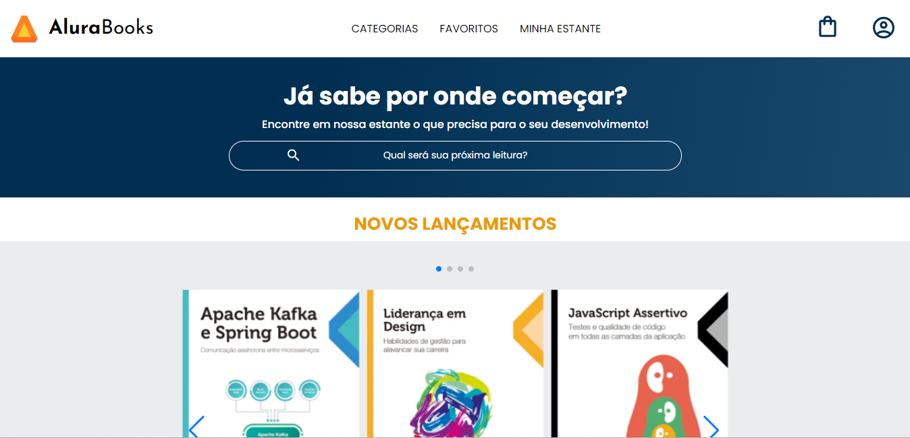
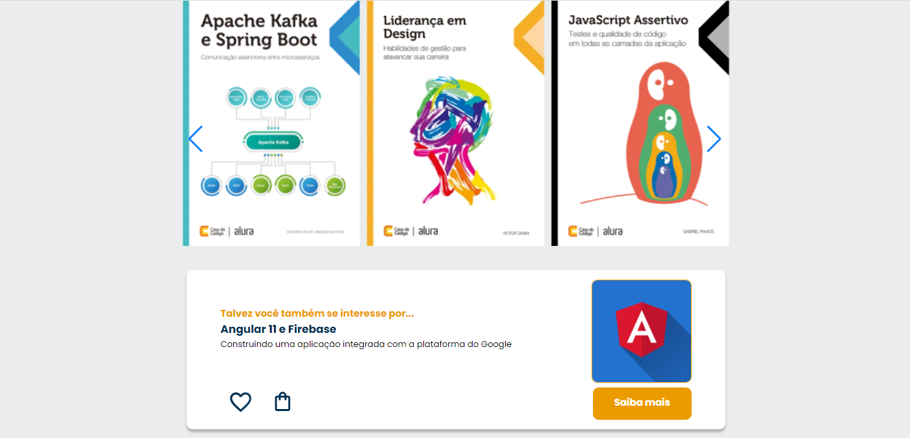
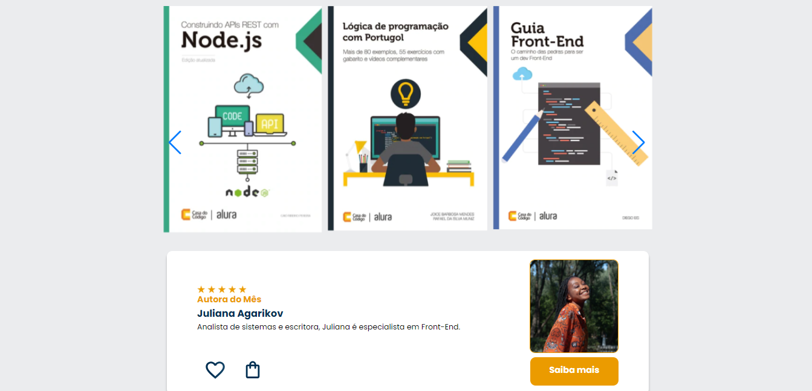
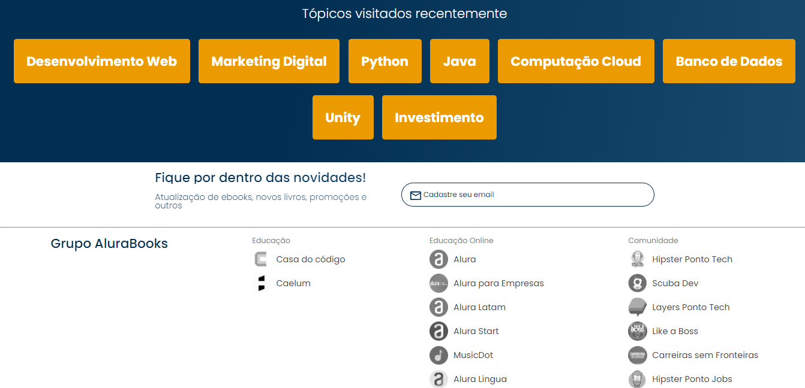
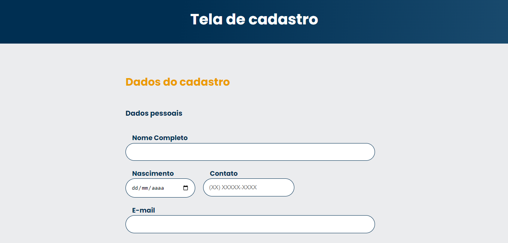
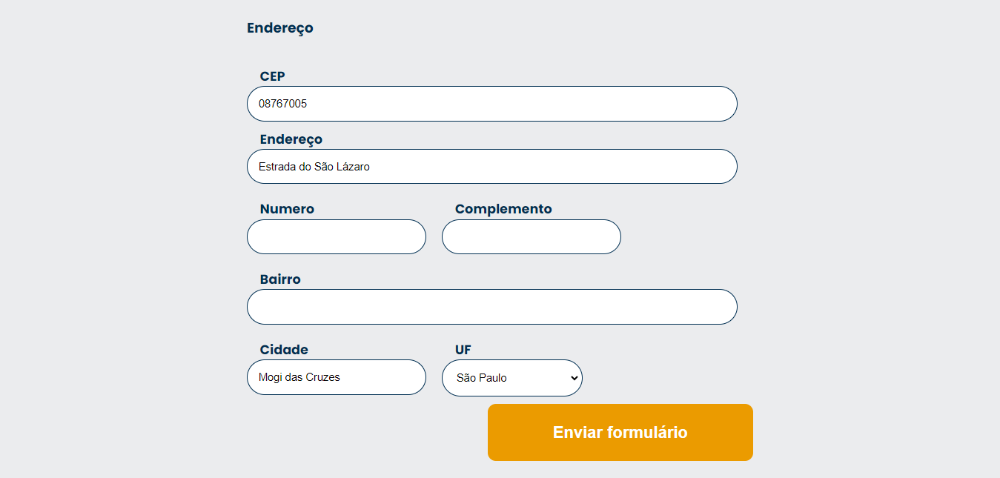
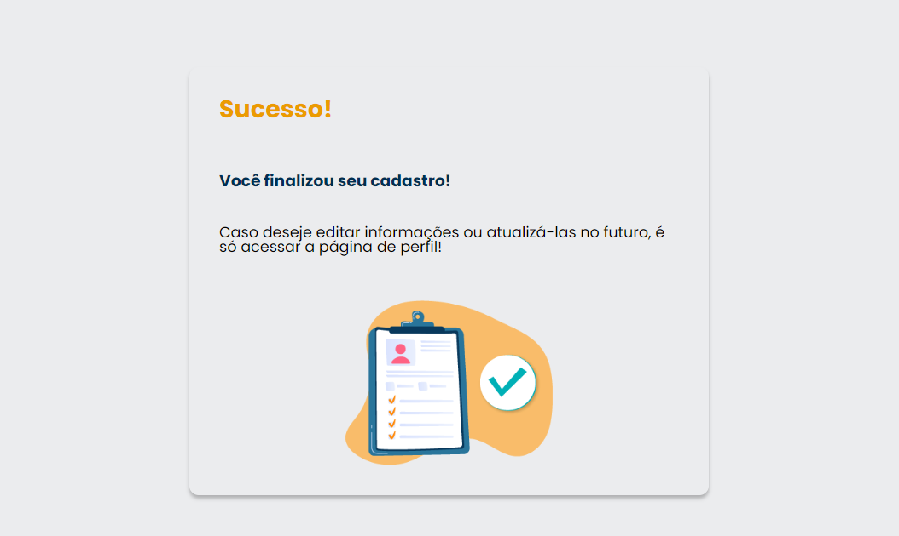
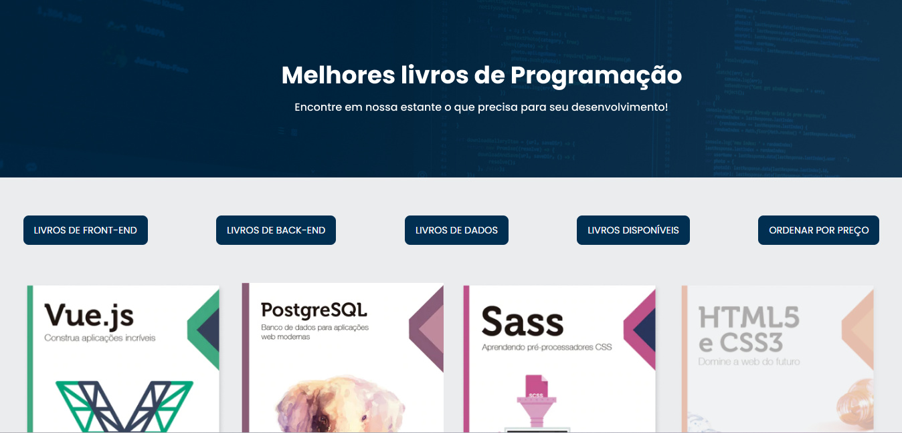

# AluraBooks

Nesse projeto feito durante o curso de <b>Desenvolvimento Web</b> da <b>Alura</b>, onde eu desenvolvi um site fictício de uma Livraria Digital, utlizando <b>HTML e CSS</b>. Onde foi abordado como estruturar e deixar a página responsiva para diferentes tamanhos de tela, consumo e tratamento de dados utilizando <b>Javascript</b> e a API do <b>ViaCep</b> para o formulário de cadastro e a utilização de métodos de array com dados externos para a criação da página de catálogo. 

<h6 align="center"><a href="https://jean-carlo-torres.github.io/AluraBooks/">**Link para testar o projeto**</a></h6>

<h2>Tópicos abordados durante esse projeto:</h2>
<ul>
<li>Construindo a estrutura do Site.</li>
<li>Responsividade e Estilização com CSS.</li>
<li>Utilização do SwiperJS para criar o carrossel.</li>
<li>Deixando o projeto ainda mais inclusivo.</li>
<li>Consumo e tratamento de dados de uma API</li>
<li>Métodos de array</li>
</ul>

<h3>Contribuindo</h3>

⭐️ Star o projeto

🐛 Encontrar e relatar issues